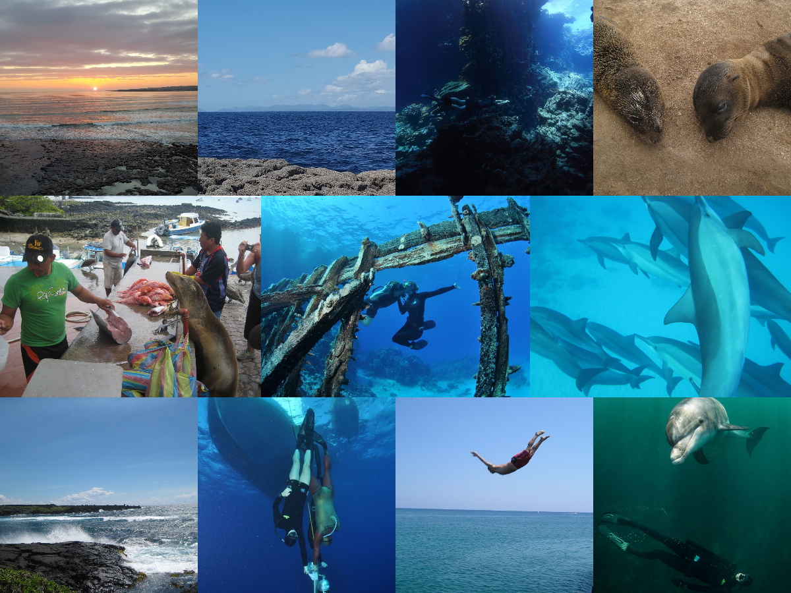
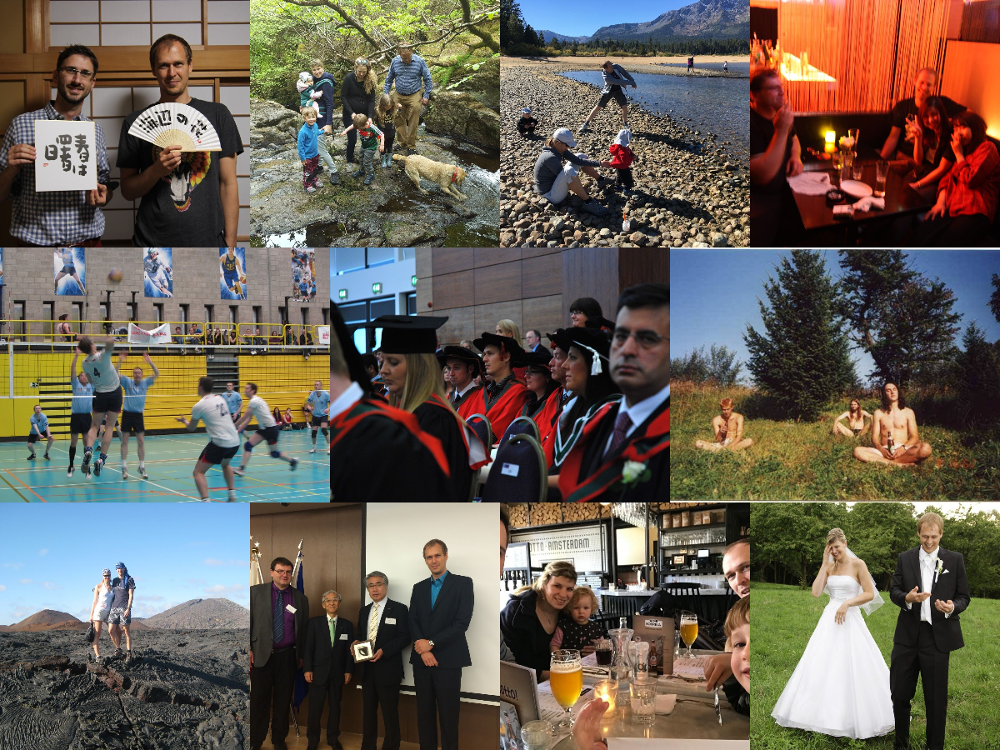

[Intro](index.html) / [Mysteries](research.html) / [Scribblings](publications.html) / [Preachings](teaching.html) / [Boring](bio.html) / **[Other](life.html)** / [Contact](contact.html)

---

Wonder what I do when I'm not striving to spawn new knowledge and pass it onto others? Well, some say a picture is worth a thousands words. Lo and behold, then...

If you're not quite sure what all that random mess means, just [ask](contact.html). Beware, though! Once I start talking about my plentiful hobbies (or pretty much anything else I'm passionate about), it may get rather tedious very soon.
